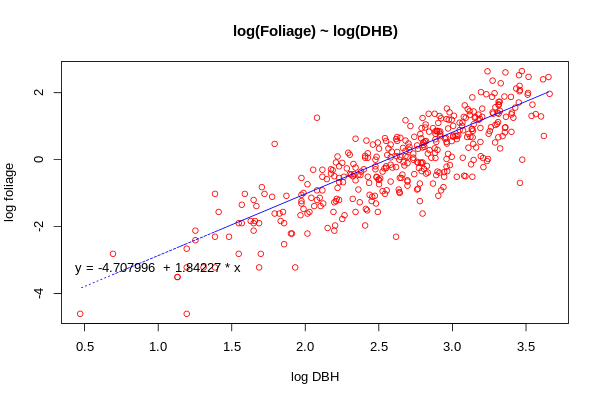

# 11.5 Link Function

---

`Link function` dạng `log` là một trong những `link functions` phổ biến cho mô hình GLMs với phân phối `Gamma` và phân phối `inverse Gaussian` để đảm bảo  $\mu > 0$ và cho mục đích diễn giải


Trong `R`, đối với phân phối `Gamma` và phân phối `inverse Gaussian`, các `link function` được sử dụng là `log`, `identity` và `inverse` (mặc định cho phân phối `Gamma`). Hàm `link = "1/mu^2"` cũng được sử dụng cho phân phối `inverse Gaussian`.

---


### Ví dụ 1
Data small-leaved lime trong dataset `lime`

```{r}
library(GLMsData); data(lime); str(lime)
```

```
'data.frame':	385 obs. of  4 variables:
 $ Foliage: num  0.1 0.2 0.4 0.6 0.6 0.8 1 1.4 1.7 3.5 ...
 $ DBH    : num  4 6 8 9.6 11.3 13.7 15.4 17.8 18 22 ...
 $ Age    : int  38 38 46 44 60 56 72 74 68 79 ...
 $ Origin : Factor w/ 3 levels "Coppice","Natural",..: 2 2 2 2 2 2 2 2 2 2 ...
```
Trong đó

`Foliage` là khối lượng tán lá tính bằng `kg`

`DBH` là đường kính cây tính bằng `cm`

`Age` là tuổi cây tính bằng năm

`Origin` là nguồn gốc của cây: `Coppice`, `Natural` và `Planted`

---
### Ví dụ 1

##### Sử dụng phân phối `Gamma` với các `link functions` khác nhau.

Với `link function` dạng `log`

```{r}
lime.log <- glm(Foliage ~ Origin * log(DBH), family=Gamma(link="log"),data=lime)
lime.log$coefficients
```

```
(Intercept)    log(DBH) 
  -4.707996    1.842207
```
---
### Ví dụ 1


---
### Ví dụ 1
Với `inverse link function`
```{r}
lime.inv <- update(lime.log, family=Gamma(link="inverse"))
```

`R` đưa ra cảnh báo

```
Warning in log(ifelse(y == 0, 1, y/mu)) : NaNs produced
```

`R` không thể tìm được các điểm bắt đầu phù hợp với mô hình, chúng ta có thể cung cấp cho hàm `glm()` các điểm bắt đầu sử dụng `mustart` (cho thang đo của data) hoặc `etastart` cho thang dự đoán tuyến tính

```{r}
lime.inv <- update(lime.log, family=Gamma(link="inverse"), mustart=fitted(lime.log))
```
`R` tiếp tục báo lỗi như trên vậy nên chúng ta không xem xét mô hình này nữa. Hoàn toàn tương tự với `link function` `identity`

---

# 11.6 Ước lượng tham số phân tán

---

## 11.6.1 Ước lượng tham số phân tán cho phân bố Gamma
Với phân bố Gamma, ước lượng hợp lý cự đại (`MLE`) của tham số phân tán $\phi$ không có dạng gần đúng mà `MLE` cho $\phi$ là nghiệm của phương trình

$$D(y, \hat{\mu}) = -2 \sum_{i=1}^n w_i \log\phi - w_i \log w_i + w_i \psi(w_i / \phi) \tag{11.6.1.1}$$

Trong đó $D(y, \hat{\mu})$ là phần dư và $n$ là cỡ mẫu.

Phương trình này được giải bằng phương pháp lặp, chính vì vậy ước lượng Pearson và ước lượng deviance thường được sử dụng nhiều hơn.

---

## 11.6.1 Ước lượng tham số phân tán cho phân bố Gamma
Ước lượng deviance 
$$\tilde{\phi} = \dfrac{D(y, \hat{\mu})}{n - p'}$$
thường có ý nghĩa cho các giá trị $y_i$ rất bé trong phân phối `Gamma` nên ta có thể ưu tiên dùng ước lượng Pearson
$$\bar\phi = \dfrac{1}{n - p'} \sum_{i = 1}^n \dfrac{w_i}{\hat\mu_i^2}$$
khi còn nghi ngờ độ chính xác của các giá trị nhỏ

---

## 11.6.1 Ước lượng tham số phân tán cho phân bố Gamma
### Ví dụ 11.5
Xét mô hình gamma `lime.log` đã được fit trong ví dụ 1 với tập dữ liệu `lime`

Ước lượng cho $\phi$
```{r}
phi.md <- deviance(lime.log)/df.residual(lime.log)
phi.pearson <- summary( lime.log )$dispersion
c( "Mean Deviance"=phi.md, "Pearson"=phi.pearson)
```

```
Mean Deviance       Pearson 
    0.4335640     0.5654569 
```

Sử dụng ước lượng hợp lý cự đại `MLE`, kết quả thu được là `0.3736`

---
### Ví du 11.6
Phân tích cho bảng deviance
```{r}
round(anova(lime.log, test="F"), 3)
```


