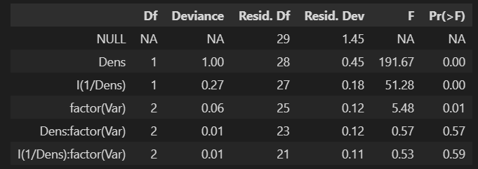
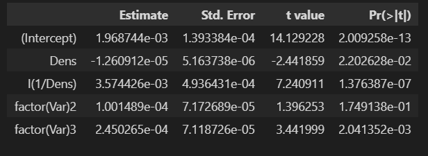

---
# try also 'default' to start simple
theme: seriph
# random image from a curated Unsplash collection by Anthony
# like them? see https://unsplash.com/collections/94734566/slidev
background:
# apply any windi css classes to the current slide
class: 'text-center'
position: 'center'
# https://sli.dev/custom/highlighters.html
highlighter: shiki
# show line numbers in code blocks
lineNumbers: false
# some information about the slides, markdown enabled
info: |
  ## Slidev Starter Template
  Presentation slides for developers.

  Learn more at [Sli.dev](https://sli.dev)
# persist drawings in exports and build
drawings:
  persist: true
---

# Nhập môn mô hình hóa 
# thống kê
## Nhóm 2
## Chương 11: Dữ liệu liên tục dương: Phân phối Gamma <br/>
## và phân phối Inverse Gaussian GLMs
Thành viên: - Nguyễn Chí Thanh
            - Đoàn Đại Thanh Long
            - Nguyễn Hữu Tuấn Nghĩa
            - Nguyễn Mạnh Linh


<style>
h1 {
  background-color: #2B90B6;
  font-size: 12px;
  background-image: linear-gradient(45deg, #4EC5D4 10%, #146b8c 20%);
  background-size: 100%;
  -webkit-background-clip: text;
  -moz-background-clip: text;
  -webkit-text-fill-color: transparent;
  -moz-text-fill-color: transparent;
}
</style>

---

<style>
h1 {
  background-color: #2B90B6;
  background-image: linear-gradient(45deg, #4EC5D4 10%, #146b8c 20%);
  background-size: 100%;
  -webkit-background-clip: text;
  -moz-background-clip: text;
  -webkit-text-fill-color: transparent;
  -moz-text-fill-color: transparent;
  -font-size: 20px;
}
</style>

# MỤC LỤC

## 11.1 Giới thiệu và tổng quan
## 11.2 Mô hình hóa dữ liệu liên tục dương
## 11.3 Phân phối Gamma
## 11.4 Phân phối Inverse Gaussian
## 11.5 Link function
## 11.6 Ước lượng tham số phân tán
## 11.7 Case Study
## 11.8 Các hàm R liên quan


<style>
h1 {
  background-color: #2B90B6;
  background-image: linear-gradient(45deg, #4EC5D4 10%, #146b8c 20%);
  background-size: 100%;
  -webkit-background-clip: text;
  -moz-background-clip: text;
  -webkit-text-fill-color: transparent;
  -moz-text-fill-color: transparent;
}
</style>


---

# 11.1 Giới thiệu và tổng quan

| Các đề mục | Người trình bày|
|-----|-----|
|11.2 giới thiệu quá trình mô hình hóa dữ liệu liên tục dương| Thanh|
|11.3 bàn luận về phân phối Gamma|Thanh|
|11.4 bàn luận về phân phối Inverse Gaussian|Thanh|
|11.5 Lựa chọn link function cho các phân phối trên|Linh|
|11.6 Ước lượng $\phi$ của các phân phối|Linh
|11.7 Trình bày một số Case Study|Long (Case Study 1) - Nghĩa (Case Study 2)|
|11.8 Tổng hợp một số hàm trong R để fit GLM với hai phân phối Gamma và Inverse Gaussian|Nghĩa|

---

# 11.1 Giới thiệu và tổng quan

- Mô hình hóa cho dữ liệu liên tục dương. Ví dụ: Các đại lượng vật lý: nhiệt độ (tuyệt đối), áp suất,...
- Hai phân phối phổ biến được chọn để mô hình hóa dữ liệu liên tục dương là phân phối Gamma và phân phối Inverse Gaussian

---

# 11.2 Mô hình hóa dữ liệu liên tục dương

- Trong nhiều ứng dụng, biến phản hồi liên tục và dương. Các biến này thường lệch phải, ranh giới giới giới hạn 0 là đuôi bên trái của phân phối

- Hệ quả ranh giới giới hạn tại 0:
$\sigma \rightarrow 0$ khi $\mu \rightarrow 0$

- Dữ liệu liên tục dương thường có mối quan hệ trung bình - phương sai tăng. Ví dụ các hàm phương sai:

$V(\mu)=\mu^2$ hoặc $V(\mu)=\mu^3$


### Ví dụ 1: Một tập dữ liệu nằm trong chuỗi các nghiên cứu về sinh khối thực vật ở lục địa Á - Âu là dữ liệu nghiên cứu về lá của cây chanh. Dataset ```lime``` trong package ```GLMsData```

- Tập dữ liệu trên nghiên cứu tính khối lượng của tán lá dựa trên đường kính của tán lá

- Ngoài ra còn thông tin tuổi và nguồn gốc của cây

---

# 11.2 Mô hình hóa dữ liệu liên tục dương

- Khối lượng của tán lá tỷ lệ với diện tích bề mặt của tán lá

- Đường kính của tán lá có liên quan đến đường kính của thân cây

- Một tán lá có thể xem như dạng gần một quả cầu. $\mu$ tỷ lệ thuận với $4\pi (\dfrac{d}{2})^2=\pi d^2 \Rightarrow \log y \propto \log \pi + 2 \log d$

- Code:

```python
library(GLMsData); data(lime); str(lime)
```

```python
'data.frame': 385 obs. of 4 variables:
$ Foliage: num 0.1 0.2 0.4 0.6 0.6 0.8 1 1.4 1.7 3.5 ...
$ DBH : num 4 6 8 9.6 11.3 13.7 15.4 17.8 18 22 ...
$ Age : int 38 38 46 44 60 56 72 74 68 79 ...
$ Origin : Factor w/ 3 levels "Coppice","Natural",..: 2 2 2 2 2 2 2
2 2 2 ...
```

---
layout: two-cols
---

# 11.2 Mô hình hóa dữ liệu liên tục dương


- Biến phản hồi (khối lượng tán lá) luôn luôn dương

- Phương sai của biến phản hồi tăng khi trung bình tăng

- Có mối liên hệ giữa khối lượng tán lá và DBH, khối lượng tán lá và tuổi

- Không có sự khác nhau nhiều về dữ liệu khối lượng tán lá theo nguồn gốc cây

::right::


- Historgram của Foliage có dạng phân phối mũ

<style>
  p {
  font-size: 12px;
}
</style>

---

# 11.3 Phân phối Gamma

- Phân phối Gamma là một phân phối thuộc họ phân phối xác suất có hai tham số.

- Phân phối Gamma có ba dạng

  - Tham số định dạng $\alpha$ và tham số phạm vi $\beta$:

  $$\mathcal{P}\big(y;\alpha,\beta\big)=\dfrac{y^{\alpha-1}\exp(-y/\beta)}{\Gamma(\alpha)\beta^{\alpha}}$$


  $$\mathrm{E}\lbrack y \rbrack=\alpha\beta$$
  $$\mathrm{var}\lbrack y \rbrack=\alpha \beta^2$$

  - Tham số định dạng $k=\alpha$ và tham số phạm vi ngược $\theta = \dfrac{1}{\beta}$


  $$\mathcal{P}\big(y;k,\theta\big)=\dfrac{y^{k-1}\theta^{k}\exp(-y\theta)}{\Gamma(k)}$$

---

# 11.3 Phân phối Gamma


---

# 11.3 Phân phối Gamma

- Theo trung bình $\mu$ và tham số phân tán $\phi$

$$\alpha=\dfrac{1}{\phi}, \beta=\mu\phi$$

$$\mathcal{P}\big(y;\mu,\phi\big)=\Bigg(\dfrac{y}{\phi \mu} \Bigg)^{1/\phi}\dfrac{1}{y}\exp\Bigg(-\dfrac{y}{\phi\mu}\Bigg)\dfrac{1}{\Gamma(1/\phi)}$$

$$\mathcal{P}\big(y;\mu,\phi\big)=\Bigg(\dfrac{y}{\phi}\Bigg)^{1/\phi}\dfrac{1}{y\Gamma(1/\phi)}\exp\Bigg(-\dfrac{y}{\phi\mu} - \dfrac{1}{\phi}\log \mu\Bigg)$$

$$\Rightarrow \begin{cases} \theta = -\dfrac{1}{\mu} \\ \kappa(\theta) = \log \mu=\log(-\dfrac{1}{\theta}) \end{cases}$$

$$\begin{cases} d(y, \mu) = 2 \lbrace t(y, y) - t(y, \mu) \rbrace = 2  \Bigg\lbrace -1 - \log y - (-\dfrac{y}{\mu} - \log \mu) \Bigg\rbrace =2\Bigg\lbrace - \log \dfrac{y}{\mu} + \dfrac{y - \mu}{\mu} \Bigg\rbrace \\ V(\mu)=\mu^2\end{cases}$$

<style>
  .katex{font-size: 0.9em;}
</style>

---

# 11.3 Phân phối Gamma


---

# 11.3 Phân phối Gamma

- Hàm link function tiêu chuẩn

$$\eta = -\dfrac{1}{\mu}$$
Thực tế hàm link function không được sử dụng do không đảm bảo $\mu > 0$ thay vào đó là hàm $\log \mu$
- Hàm phương sai:

$$V(\mu)=\mu^2$$

  - Hệ số phương sai:

  $$\dfrac{\mathrm{var}}{\mathrm{mean}^2}$$

  - Phân phối Gamma có hệ số phương sai là hằng số

---

# 11.3 Phân phối Gamma

### Ví dụ 2: Sử dụng tập dữ liệu ```lime``` ở ví dụ 1, dữ liệu được chia thành các nhóm theo tuổi cây và nguồn gốc cây, trung bình và phương sai của mỗi nhóm được tính

```python
 # Define age *groups*
> lime$AgeGrp <- cut(lime$Age, breaks=4 )
> # Now compute means and variances of each origin/age group:
> vr <- with( lime, tapply(Foliage, list(AgeGrp, Origin), "var" ) )
> mn <- with( lime, tapply(Foliage, list(AgeGrp, Origin), "mean" ) )
> # Plot
> plot( log(vr) ~ log(mn), las=1, pch=19,
xlab="log(group means)", ylab="log(group variance)")
> mf.lm <- lm( c(log(vr)) ~ c(log(mn)) )
> coef( mf.lm )
(Intercept) c(log(mn))
-0.165002 1.706453
> abline( coef( mf.lm ), lwd=2)
```

---
layout: two-cols
---

# 11.3 Phân phối Gamma


::right::

- Hệ số góc của đường thẳng giữa $\log(vr)$ và $\log(mn)$ khoảng 1.7 gần với 2. Vì vậy có thể xem:

$$\log(\mathrm{group} \thickspace \mathrm{variance}) \propto 2 \log(\mathrm{group} \thickspace \mathrm{mean})$$

- Với từng nhóm, phương sai của từng nhóm tỷ lệ với bình phương trung bình của nhóm $V(\mu)\approx\mu^2$ tương ứng với phân phối Gamma

---

# 11.3 Phân phối Gamma

- Độ lệch phần dư:

$$D(y, \hat{\mu})=\sum_{i=1}^nw_id(y_, \hat{\mu}_i)$$

- Trường hợp đặc biệt, trong trường hợp mô hình được học dùng MLE (giải một cách chính xác) và link function là hàm $\log$ thì:

$$D(y, \hat{\mu})=\sum_{i=1}^n 2 w_i \Big \lbrace -\log \dfrac{y_i}{\hat{\mu}_i} + \dfrac{y_i - \hat{\mu}_i}{\hat{\mu}_i} \Big \rbrace=\sum_{i=1}^n 2 w_i \Big \lbrace -\log \dfrac{y_i}{\hat{\mu}_i} \Big \rbrace$$


<style>
  .katex{font-size: 0.9em;}
</style>


---

# 11.3 Phân phối Gamma

- Chứng minh:

$$U(\hat{\bold{\beta}})=\dfrac{1}{\phi}X^TWM(\bold{y}-\bold{\mu})$$

$$W_{ii}=\dfrac{w_i}{V(\mu_i)\Big(\dfrac{d\eta_i}{d\hat{\mu}_i}\Big)^2}$$

$$M_{ii}=\dfrac{d\eta_i}{d\hat{\mu}_i}$$

$$U(\hat{\beta}_0)=\dfrac{1}{\phi}\sum_{i=1}^n \dfrac{w_i}{V(\mu_i)\Big(\dfrac{d\eta_i}{d\hat{\mu}_i}\Big)^2}\dfrac{d\eta_i}{d\hat{\mu}_i}(y_i - \hat{\mu}_i)=0$$

$$U(\hat{\beta}_0)=\dfrac{1}{\phi}\sum_{i=1}^n \dfrac{w_i}{\hat{\mu}_i^2\Big(\dfrac{1}{\hat{\mu}_i}\Big)^2}\dfrac{y_i - \hat{\mu}_i}{\hat{\mu}_i}=\dfrac{1}{\phi}\sum_{i=1}^n\dfrac{w_i(y_i - \hat{\mu}_i)}{\hat{\mu}_i}=0$$

<style>
  .katex{font-size: 0.95em;}
</style>

---

# 11.3 Phân phối Gamma

- $D(y, \hat{\mu}) \sim \chi_{n-p'}^2$ 
nếu điều kiện xấp xỉ hàm yên ngựa được thỏa mãn. Đối với phân phối Gamma điều kiện xấp xỉ hàm yên ngựa được thỏa mãn khi $\phi \leq \dfrac{1}{3}$

- Xét:
$$\mathcal{P}\big(y;\mu,\phi\big)=\Bigg(\dfrac{y}{\phi}\Bigg)^{1/\phi}\dfrac{1}{y\Gamma(1/\phi)}\exp\Bigg(-\dfrac{y}{\phi\mu} - \dfrac{1}{\phi}\log \mu\Bigg)\\=\Bigg(\dfrac{y}{\phi}\Bigg)^{1/\phi}\dfrac{1}{y\Gamma(1/\phi)}\exp\Big(\dfrac{t(y, y)}{\phi}\Big)\exp\Bigg(-\dfrac{d(y, \mu)}{2\phi}\Bigg)\\=\Bigg(\dfrac{y}{\phi}\Bigg)^{1/\phi}\dfrac{1}{y\Gamma(1/\phi)}\exp\Big(\dfrac{-1 - \log y}{\phi}\Big)\exp\Bigg(-\dfrac{d(y, \mu)}{2\phi}\Bigg)$$

- Khi $\phi \leq 1/3$: Theo công thức xấp xỉ Stirling:

$$\Gamma(1 / \phi) \approx \sqrt{2\pi \phi}\Bigg(\dfrac{1}{\phi e}\Bigg)^{1/\phi}$$

<style>
  .katex{font-size: 0.9em;}
</style>

---

# 11.3 Phân phối Gamma

- Thay vào ta được:

$$\mathcal{P}\big(y;\mu,\phi\big)\approx\Bigg(\dfrac{y}{\phi}\Bigg)^{1/\phi}\dfrac{1}{y\sqrt{2\pi \phi}\Bigg(\dfrac{1}{\phi e}\Bigg)^{1/\phi}}\Bigg(\dfrac{1}{e}\Bigg)^{1/\phi}y^{-1/\phi}\exp\Bigg(-\dfrac{d(y, \mu)}{2\phi}\Bigg)\\=\dfrac{1}{\sqrt{2\pi\phi y^2}}\exp\Bigg(-\dfrac{d(y, \mu)}{2\phi}\Bigg)=\dfrac{1}{\sqrt{2\pi\phi V(y)}}\exp\Bigg(-\dfrac{d(y, \mu)}{2\phi}\Bigg)=\tilde{\mathcal{P}}(y;\mu, \phi)$$

- $\phi$ không biết trước được ước lượng ở mục 11.6

---
layout: two-cols
---

# 11.3 Phân phối Gamma

- Mối quan hệ với phân phối Poisson:

  - Với các sự kiện xảy ra tuân theo phân phối Poisson, khoảng thời gian giữa hai sự kiện liên tiếp xảy ra tuân theo phân phối Gamma

  - Gọi một sự kiện xảy ra theo phân phối Poisson trong chu kỳ $T$ với tần suất $\lambda$ trong một đơn vị thời gian. Khoảng thời gian $y$ cần để chờ $r$ sự kiện xảy ra tuân theo phân phố Gamma với trung bình là $\dfrac{r}{\lambda}$ và phương sai là $\dfrac{r}{\lambda^2}$


 
::right::


- Ví dụ: Một sự kiện xảy ra với tần suất $\lambda=0.2$ lần trên giây. Độ dài thời gian $y$ để đợi $r=10$ sự kiện xảy ra tuân theo phân phối Gamma với trung bình là $\dfrac{r}{\lambda}=\dfrac{10}{0.2}=50(s)$ và phương sai là $\dfrac{r}{\lambda^2}=\dfrac{r}{\lambda^2}=\dfrac{10}{0.2^2}=250(s^2)$ 


---

# 11.4 Phân phối Inverse Gaussian

- Phân phối Inverse Gaussian cũng là một phân phối phù hợp để mô hình hóa dữ liệu liên tục dương

- Hàm mật độ xác suất của phân phối Inverse Gaussian:

$$\mathcal{P}(y;\mu,\phi)=\Big(2\pi y^3 \phi\Big)^{-1/2}\exp \Big \lbrace - \frac{1}{2\phi} \frac{(y-\mu)^2}{y\mu^2} \Big \rbrace$$

với

$$\begin{cases} y > 0 \\ \mu > 0 \\ \phi > 0 \end{cases}$$

- Khi $\mu \rightarrow \infty$, phân phối Inverse Gaussian trở thành phân phối Levy ($\mathrm{var} \rightarrow \infty$):

$$\mathcal{P}(y;\phi)=\dfrac{1}{\sqrt{2\pi y^3\phi}}\exp \Big \lbrace -\dfrac{1}{2\phi y} \Big \rbrace$$


---

# 11.4 Phân phối Inverse Gaussian

- Tìm $\theta$ và $\kappa(\theta)$
$$\mathcal{P}(y;\mu,\phi)=\Big(2\pi y^3 \phi\Big)^{-1/2}\exp \Big \lbrace - \frac{1}{2\phi} \frac{(y-\mu)^2}{y\mu^2} \Big \rbrace\\=\dfrac{1}{\sqrt{2\pi y^3\phi}}\exp\Big\lbrace - \dfrac{y^2 - 2y\mu + \mu^2}{2\phi y\mu^2} \Big\rbrace\\=\dfrac{1}{\sqrt{2\pi y^3\phi}}\exp\Big\lbrace -\dfrac{1}{2\phi y} \Big\rbrace \exp \Big \lbrace - \dfrac{y}{2\phi\mu^2} + \dfrac{1}{\phi \mu} \Big \rbrace $$

$$\begin{cases} \theta = - \dfrac{1}{2\mu^2} \\ \kappa(\theta)=-\dfrac{1}{\mu} \end{cases}$$

$$\begin{cases}V(\mu)=\mu^3 \\ d(y, \mu)=2 \Big \lbrace -\dfrac{y}{2 y^2} + \dfrac{1}{y} - \Big(-\dfrac{y}{2\mu^2} + \dfrac{1}{\mu}\Big) \Big \rbrace=\dfrac{(y - \mu)^2}{y\mu^2} \end{cases} $$

---

# 11.4 Phân phối Inverse Gaussian

- Hàm link function tiêu chuẩn:

$$\eta = \dfrac{1}{\mu^2}$$

- Hàm phương sai:

$$V(\mu)=\mu^3$$

- Đối với phân phối Inverse Gaussian, hàm mật độ xác suất chính xác bằng hàm yên ngựa:


$$\mathcal{P}(y;\mu,\phi)=\dfrac{1}{\sqrt{2\pi y^3\phi}}\exp\Big\lbrace -\dfrac{1}{2\phi y} \Big\rbrace \exp\Big\lbrace \dfrac{t(y, y)}{\phi} \Big\rbrace \exp \Big \lbrace - \dfrac{d(y, \mu)}{2\phi} \Big \rbrace\\=\dfrac{1}{\sqrt{2\pi \phi y^3}}\exp \Big \lbrace - \dfrac{d(y, \mu)}{2\phi} \Big \rbrace=\dfrac{1}{\sqrt{2\pi \phi V(y)}}\exp \Big \lbrace - \dfrac{d(y, \mu)}{2\phi} \Big \rbrace=\tilde{\mathcal{P}}(y; \mu, \phi)$$


$\Rightarrow$ Hàm độ lệch đơn vị $d(y, \mu)$ tuân theo phân phối $\chi_1^2$

- $\phi$ không biết trước được ước lượng ở mục 11.6

<style>
  .katex{font-size: 0.9em;}
</style>

---


# 11.4 Phân phối Inverse Gaussian


- Mối quan hệ giữa phân phối Inverse Gaussian và phân phối Gaussian:

  - Chuyển động Brown: Là một chuyển động ngẫu nhiên của phân tử trong không khí theo thời gian

  - Phân phối Inverse Gaussian miêu tả phân phối của khoảng thời gian cần thiết $y$ để đạt đến một điểm cách một khoảng $\delta$ cố định từ vị trí hiện tại.

  - Ngược lại, phân phối chuẩn miêu tả phân phối khoảng cách $\delta$ từ vị trí hiện tại trong khoảng thời gian $\tau$ cố định cho trước.


---

# 11.4 Phân phối Gaussian


- Hình 1 miêu tả liên hệ giữa khoảng thời gian và khoảng cách đến điểm gốc của một phân tử trong một phép thử

- Phân phối khoảng thời gian cần để phân tử đạt đến một điểm cách $\delta=5$

- Cho trước khoảng thời gian $\tau=20$, qqplot của khoảng cách tính từ điểm gốc mà phân tử đi được


---

# 11.5 Link Function


- `Link function` dạng `log` là một trong những `link functions` phổ biến cho mô hình GLMs với phân phối `Gamma` và phân phối `inverse Gaussian` để đảm bảo  $\mu > 0$ và cho mục đích diễn giải

Trong `R`, đối với phân phối `Gamma` và phân phối `inverse Gaussian`, các `link function` được sử dụng là `log`, `identity` và `inverse` (mặc định cho phân phối `Gamma`). Hàm `link = "1/mu^2"` cũng được sử dụng cho phân phối `inverse Gaussian`.


---

# 11.5 Link Function

- Ví dụ 1 

Data small-leaved lime trong dataset `lime`

```python
library(GLMsData); data(lime); str(lime)
```

```python
'data.frame':	385 obs. of  4 variables:
 $ Foliage: num  0.1 0.2 0.4 0.6 0.6 0.8 1 1.4 1.7 3.5 ...
 $ DBH    : num  4 6 8 9.6 11.3 13.7 15.4 17.8 18 22 ...
 $ Age    : int  38 38 46 44 60 56 72 74 68 79 ...
 $ Origin : Factor w/ 3 levels "Coppice","Natural",..: 2 2 2 2 2 2 2 2 2 2 ...
```

---

# 11.5 Link Function

- Ví dụ 1:

Trong đó

`Foliage` là khối lượng tán lá tính bằng `kg`

`DBH` là đường kính cây tính bằng `cm`

`Age` là tuổi cây tính bằng năm

`Origin` là nguồn gốc của cây: `Coppice`, `Natural` và `Planted`

---

# 11.5 Link Function

#### Sử dụng phân phối `Gamma` với các `link functions` khác nhau.

Với `link function` dạng `log`

```python
lime.log <- glm(Foliage ~ log(DBH), family=Gamma(link="log"),data=lime)
lime.log$coefficients
```

```python
(Intercept)          OriginNatural          OriginPlanted 
-4.6289255              0.3245216             -1.5284910 
  log(DBH) OriginNatural:log(DBH) OriginPlanted:log(DBH) 
  1.8431878             -0.2040329              0.5767826
```

---

# 11.5 Link function

- Với `inverse link function`

```python
lime.inv <- update(lime.log, family=Gamma(link="inverse"))
```

- `R` đưa ra cảnh báo

```python
Warning in log(ifelse(y == 0, 1, y/mu)) : NaNs produced
```

- `R` không thể tìm được các điểm bắt đầu phù hợp với mô hình, chúng ta có thể cung cấp cho hàm `glm()` các điểm bắt đầu sử dụng `mustart` (cho thang đo của data) hoặc `etastart` cho thang dự đoán tuyến tính

```python
lime.inv <- update(lime.log, family=Gamma(link="inverse"), mustart=fitted(lime.log))
```

- `R` tiếp tục báo lỗi như trên vậy nên chúng ta không xem xét mô hình này nữa. Hoàn toàn tương tự với `link function` `identity`


---
layout: two-cols
---

# 11.5 Link function

- log-link model


---
layout: two-cols
---

# 11.5 Link function

- Một vài hàm `link function` dạng log


::right::


---


# 11.6 Ước lượng tham số phân tán

## 11.6.1 Ước lượng tham số phân tán cho phân bố Gamma

- Với phân bố Gamma, ước lượng hợp lý cự đại (`MLE`) của tham số phân tán $\phi$ không có dạng gần đúng mà `MLE` cho $\phi$ là nghiệm của phương trình

$$D(y, \hat{\mu}) = -2 \sum_{i=1}^n w_i \log\phi - w_i \log w_i + w_i \psi(w_i / \phi)$$

- Trong đó $D(y, \hat{\mu})$ là phần dư và $n$ là cỡ mẫu, $\psi(x) = \Gamma(x)'/\Gamma(x)$.

- Phương trình này được giải bằng phương pháp lặp, chính vì vậy ước lượng Pearson và ước lượng deviance thường được sử dụng nhiều hơn.

---

# 11.6 Ước lượng tham số phân tán

- Ước lượng deviance 
$$\tilde{\phi} = \dfrac{D(y, \hat{\mu})}{n - p'}$$
thường có ý nghĩa cho các giá trị $y_i$ rất bé trong phân phối `Gamma` nên ta có thể ưu tiên dùng ước lượng Pearson
$$\bar\phi = \dfrac{1}{n - p'} \sum_{i = 1}^n \dfrac{w_i(y_i - \hat\mu_i)^2}{\hat\mu_i^2}$$
khi còn nghi ngờ độ chính xác của các giá trị nhỏ

---

# 11.6 Ước lượng tham số phân tán

### Ví dụ 11.5

- Xét mô hình gamma `lime.log` đã được fit trong ví dụ 1 với tập dữ liệu `lime`

Ước lượng cho $\phi$

```python
phi.md <- deviance(lime.log)/df.residual(lime.log)
phi.pearson <- summary(lime.log)$dispersion
c("Mean Deviance"=phi.md, "Pearson"=phi.pearson)
```

```python
Mean Deviance       Pearson 
    0.4028747     0.5443774  
```

Sử dụng ước lượng hợp lý cực đại `MLE`, kết quả thu được là `0.3736`


---

# 11.6 Ước lượng tham số phân tán

### Ví dụ 11.6

Kiểm định anova

```python
round(anova(lime.log, test="F"), 3)
```

```python
Df Deviance Resid. Df Resid. Dev       F Pr(>F)    
NULL                              384     508.48                   
Origin           2    19.89       382     488.59  18.272 <2e-16 ***
log(DBH)         1   328.01       381     160.58 602.535 <2e-16 ***
Origin:log(DBH)  2     7.89       379     152.69   7.247  0.001 ***
---
Signif. codes:  0 ‘***’ 0.001 ‘**’ 0.01 ‘*’ 0.05 ‘.’ 0.1 ‘ ’ 1
```

Mặc định `R` sử dụng ước lượng Pearson của $\phi$ và `F-test` để tính toán

---

# 11.6 Ước lượng tham số phân tán


- Ngoài ra cũng có thể ước lượng $\phi$ theo cách khác

```python
round(anova(lime.log,test="F", dispersion=phi.md), 3)
```

```python
                Df Deviance Resid. Df Resid. Dev       F    Pr(>F)    
NULL                              384     508.48                      
Origin           2    19.89       382     488.59  24.690 < 2.2e-16 ***
log(DBH)         1   328.01       381     160.58 814.165 < 2.2e-16 ***
Origin:log(DBH)  2     7.89       379     152.69   9.793 < 2.2e-16 ***
---
Signif. codes:  0 ‘***’ 0.001 ‘**’ 0.01 ‘*’ 0.05 ‘.’ 0.1 ‘ ’ 1
```

Kết luận khá tương đồng với ước lượng khác

---

# 11.6 Ước lượng tham số phân tán


- Các hệ số được ước lượng:

```python
printCoefmat(coef(summary(lime.log)), 3)
```

```python
                       Estimate Std. Error t value Pr(>|t|)    
(Intercept)              -4.629      0.276  -16.79   <2e-16 ***
OriginNatural             0.325      0.388    0.84   0.4037    
OriginPlanted            -1.528      0.573   -2.67   0.0079 ** 
log(DBH)                  1.843      0.102   18.15   <2e-16 ***
OriginNatural:log(DBH)   -0.204      0.143   -1.42   0.1554    
OriginPlanted:log(DBH)    0.577      0.209    2.76   0.0061 ** 
---
Signif. codes:  0 ‘***’ 0.001 ‘**’ 0.01 ‘*’ 0.05 ‘.’ 0.1 ‘ ’ 1
```

Có sự khác nhau một chút giữa loại cây tự nhiên và cây được trồng

---

# 11.6 Ước lượng tham số phân tán

## 11.6.2 Ước lượng tham số phân tán cho phân bố Inverse Gaussian

Đối với phân bố `inverse Gaussian` thì `MLE` cho tham số phân tán là

$$\hat{\phi} = \dfrac{D(y, \hat{\mu})}{n}$$

Nhìn chung thì đây là 1 ước lược chệch của $\phi$. Ước lượng devience trung bình:

$$\tilde{\phi} = \dfrac{D(y, \hat{\mu})}{n - p'}$$

giống với dạng `MLE` gần như không chệch

Ước lượng devience trung bình nhìn chung là tốt về mặt lý thuyết và được dùng khi dữ liệu có chất lượng tốt

---

# 11.6 Ước lượng tham số phân tán

- Pearson estimation cho $\phi$

$$\bar{\phi} = \dfrac{1}{n - p'} \sum_{i = 1}^{n} \dfrac{w_i (y_i - \hat{\mu}_i)}{\hat{\mu}_i^3}$$

Trong phân phối `inverse Gaussian` thì độ lệch khá 'nhạy cảm' với lỗi làm tròn với những giá trị $y_i$ nhỏ nên ước lượng Pearson sẽ tốt hơn là ước lượng độ lệch trung bình khi giá trị của $y$ là nhỏ.

---

# 11.6 Ước lượng tham số phân tán

### Ví dụ 11.7

```python
lime.iG <- glm( Foliage ~ Origin * log(DBH), family=inverse.gaussian(link="log"), data=lime)
```

```python
phi.iG.mle <- deviance(lime.iG)/length(lime$Foliage) # ML estimate
phi.iG.md <- deviance(lime.iG)/df.residual(lime.iG) # Mean dev
phi.iG.pearson <- summary( lime.iG )$dispersion # Pearson
c("MLE"=phi.iG.mle, "Mean dev."=phi.iG.md, "Pearson"=phi.iG.pearson)
```

Kết quả thu được cho ước lượng của $\phi$ với các loại ước lượng `MLE`, `mean deviation`, `Pearson`

```python
      MLE Mean dev.   Pearson 
 1.056659  1.073387  1.255992
```

---

# 11.6 Ước lượng tham số phân tán

- Akaike’s An Information Criterion
nhắc lại

$$AIC = -2 \times l(\hat{\beta}_0,...,\hat{\beta}_p, \phi; y) + 2p' $$

trong đó $l$ là hàm $log$ likelihood

Giá trị càng nhỏ thì model càng tốt.

```python
c("Gamma:"=AIC(lime.log), "inv. Gauss.:"=AIC(lime.iG))
```

```python
  Gamma: inv. Gauss.: 
750.3267    1089.5297
```

Ta nhận thấy rằng mô hình gamma GLM tốt hơn so với inverse Gaussian GLM


---
layout: two-cols
---

# 11.7 Case Study 

# 11.7.1: Case Study 1:

- Dataset perm cho ta biết mức độ thấm (thẩm thấu) của 3 loại tấm vật liệu khác khau có độ dày như nhau.


::right::

- Trong đó: 
  - A là mức độ thấm của vật liệu trên máy A
  - B là mức độ thấm của vật liệu trên máy B
  - C là mức độ thấm của vật liệu trên máy C
  - 1 - 9: các ngày kiểm chứng perm của các tấm vật liệu.

- Giả sử các phân tử thấm qua các tấm vật liệu là đồng nhất, mức độ thấm (permeability) là 1 đại lượng liên tục dương.
- Chuyển động của các phân tử trong không khí là một chuyển động ngẫu nhiên theo thời gian. Đây là chuyển động Brown
$\Rightarrow$ Lựa chọn mô hình Inverse Gaussian với link funtion là hàm Log cho bài toán

---

# 11.7 Case Study 

# 11.7.1: Case Study 1:

- Dựng biểu đồ cho dữ liệu trên, ta thấy phương sai tăng dần theo giá trị trung bình và xuất hiện các giá trị outlier tiềm ẩn:


---
layout: two-cols
---

# 11.7 Case Study 

# 11.7.1: Case Study 1:

- Sử dụng model Inverse Gauusian và kiểm định Anova cho dữ liệu:


- Ta thấy biến ```day``` có pvalue lớn hơn 0.05, ảnh hưởng không đáng kể đến mô hình, vì vậy ta có thể loại bỏ ```day``` ra khỏi mô hình.

::right::

- Ước lượng tham số phân tán $\phi$ cho mô hình, ta được:


---

# 11.7 Case Study 

# 11.7.1: Case Study 1:

## Tính goodness of fit tests:
- Sử dụng Gof để kiểm định liệu mô hình đã đủ các biế vgiải thích để biểu diễn xu hướng của dữ liệu hay chưa (kiểm định tính đầy đủ của mô hình).
- Hàm độ lệch đơn vị của iG tuân theo phân phối chisq.
$\Rightarrow$ Sử dụng 2 phương pháp kiểm định Goodness of Fit deviance và pearson với giả thiết H0: mô hình hiện tại gần sát với mô hình bão hòa; và đối thiết H1: Mô hình hiện tại khác với mô hình bão hòa

---

# 11.7 Case Study 

# 11.7.1: Case Study 1:

## Tính Goodness of Fit tests
- Kết quả:

- Kết luận: Các kiểm định Deviance và Pearson đều chấp nhận H0 => Mô hình Iverse Gaussian phù hợp với dữ liệu

---
layout: two-cols
---

# 11.7 Case Study 

# 11.7.1: Case Study 1:

- Các tham số ước lượng của mô hình:


::right::

Mô hình cho thấy:
- Kiểm định wald test cho thấy p-value của machB <0.05 => biến giải thích đóng góp tốt cho mô hình 
- Permeability của vật liệu trên máy B bằng 0.5278 so với máy A (mức tham chiếu).
- Tương tự ```perm``` của vật liệu trên máy C bằng 0.84113 so với máy A.

$\Rightarrow$ Vật liệu trên máy C tương tự với máy A; vật liệu trên máy B khác biệt so với 2 máy còn lại.

---

# 11.7 Case Study 

# 11.7.1: Case Study 1:

## Kiểm tra các điểm outliers trong mô hình
- Ta có thể kiểm tra mô hình được trang bị để xác định xem liệu quan sát lớn được xác định trong Hình 2 có phải là outliers hay không và có ảnh hưởng đến mô hình hay hay không.

- Kết luận: Không có phần dư nào xuất hiện quá lớn. Không có quan sát nào có ảnh hưởng theo Cook distance

---
layout: two-cols
---

# 11.7 Case Study

## 11.7.2 Case Study 2

- Dataset yieldden cho ta biết năng suất của 3 loại hành tây khác khau


- Trong đó: 
  - Yield là năng suất của 1 cây, tính theo gam
  - Density là mật độ cây trên 1 feet vuông, ký hiệu số cây/feet vuông

::right::

- Năng suất theo từng cây, ký hiệu là $z$ , và mật độ cây trồng, ký hiệu là $x$, có mối tương quan được biểu diễn bằng theo công thức:
$$\mathrm{E}\lbrack z \rbrack = \frac{1}{\beta_2 + \beta_0 x + \beta_1 x^2}$$
- Năng suất theo đơn vị diện tích, ký hiệu $y$ với $y = xz$, ta có: 
$$\mu = \mathrm{E} \lbrack y \rbrack = x \mathrm{E} \lbrack z \rbrack = \frac{x}{\beta_2 + \beta_0 x + \beta_1 x^2}$$
- Lấy nghịch đảo:
$$\frac{1}{\mu} = \beta_0 + \beta_1 x + \beta_2 \Bigg( \frac{1}{x} \Bigg)=\eta$$

---
layout: two-cols
---

# 11.7 Case Study

## 11.7.2 Case Study 2

- Biểu dồ thể hiện mối liên hệ giữa ba biến Năng suất, Mật độ và Năng suất/Mật độ:


::right::


- Từ biều đồ, ta thấy, khi mật độ tăng, thì sản lượng của 1 cây hành tây sẽ giảm nhưng sản lượng của toàn bộ đơn vị diện tích hành tây sẽ tăng lên
=> ta sẽ sử dụng Gamma GLM với link function là inverse để tính toán

---
layout: two-cols
---

# 11.7 Case Study

## 11.7.2 Case Study 2

- Hàm gamma GLM:


- Ta thấy vẫn còn nhiều biến có pvalue lớn hơn 0.05, không đống góp nhiều cho mô hình, nên sử dụng hàm update để loại bỏ các biến đó

::right::

- Sau khi update ta được:


- p-value của Wald test đều nhỏ hơn 0.05 => các biến giải thích đóng góp tốt cho mô hình
- Lại có tham số phân tán phi = 0.004789151 < 1/3: Điều kiện xấp xỉ yên ngựa được thỏa mãn

---

# 11.8 Các hàm R liên quan

- Gamma GLMs được biểu diễn trong R bằng cách sử dụng hàm glm(formula, family = Gamma)
- Inverse Gaussian GLMs được biểu diễn trong R bằng cách sử dụng hàm glm(family= inverse.gaussian)
- Link function `inverse`, `identity`, "log" có thể được sử dụng cho cả Gamma GLMs và Inverse Gaussian GLMs. Ngoài ra, Inverse Gaussian GLMs còn có thể sử dụng link function `1/mu^2`

---

# Link slide

- https://github.com/NguyenThanhAI/Introduction_to_Statistical_Modeling_Slide

---

# PHỤ LỤC

- Chứng minh công thức ước lượng $\phi$ bằng MLE `(11.3)` của phân phối Gamma trang 436:

$$\mathcal{P}\big(y;\mu,\phi\big)=\Bigg(\dfrac{y}{\phi \mu} \Bigg)^{1/\phi}\dfrac{1}{y}\exp\Bigg(-\dfrac{y}{\phi\mu}\Bigg)\dfrac{1}{\Gamma(1/\phi)}$$

$$\mathcal{P}\Bigg(y_i;\mu_i,\dfrac{\phi}{w_i}\Bigg)=\Bigg(\dfrac{w_iy_i}{\phi \mu_i} \Bigg)^{w_i/\phi}\dfrac{1}{y}\exp\Bigg(-\dfrac{w_iy_i}{\phi_i\mu_i}\Bigg)\dfrac{1}{\Gamma(w_i/\phi)}$$

$$\log\mathcal{P}\Bigg(y_i;\mu_i,\dfrac{\phi}{w_i}\Bigg)=\dfrac{w_i}{\phi}\log\Bigg(\dfrac{w_iy_i}{\phi \mu_i}\Bigg)-\log y - \dfrac{w_iy_i}{\phi \mu_i} - \log \Gamma(w_i/\phi)$$

$$\dfrac{\partial \log\mathcal{P}\Bigg(y_i;\mu_i,\dfrac{\phi}{w_i}\Bigg)}{\partial \phi}=-\dfrac{w_i}{\phi^2}\log\Bigg(\dfrac{w_iy_i}{\phi \mu_i}\Bigg) - \dfrac{w_i}{\phi^2} + \dfrac{w_iy_i}{\mu_i\phi^2} + \dfrac{w_i}{\phi^2}\dfrac{\Gamma'(w_i/\phi)}{\Gamma(w_i/\phi)}=0$$


---

# PHỤ LỤC

- Giản ước ở mẫu có $\phi^2$:

$$\Rightarrow -w_i\log\Bigg(\dfrac{w_iy_i}{\phi \mu_i}\Bigg) - w_i + \dfrac{w_iy_i}{\mu_i} + w_i\dfrac{\Gamma'(w_i/\phi)}{\Gamma(w_i/\phi)}=0$$

$$\Rightarrow -w_i \log\Bigg(\dfrac{y_i}{\mu_i}\Bigg) + w_i \dfrac{y_i - \mu_i}{\mu_i}=-w_i\log(\phi) + w_i\log(w_i) - w_i\dfrac{\Gamma'(w_i/\phi)}{\Gamma(w_i/\phi)}$$

$$\Rightarrow 2\Bigg\lbrace-w_i \log\Bigg(\dfrac{y_i}{\mu_i}\Bigg) + w_i \dfrac{y_i - \mu_i}{\mu_i}\Bigg\rbrace=2 \Bigg \lbrace -w_i\log(\phi) + w_i\log(w_i) - w_i\dfrac{\Gamma'(w_i/\phi)}{\Gamma(w_i/\phi)} \Bigg \rbrace$$

$$\Rightarrow w_id(y_i, \mu_i)=2 \Bigg \lbrace -w_i\log(\phi) + w_i\log(w_i) - w_i\dfrac{\Gamma'(w_i/\phi)}{\Gamma(w_i/\phi)} \Bigg \rbrace$$

$$\Rightarrow D(y_i, \hat{\mu}_i)=2\sum_{i=1}^n -w_i\log(\phi) + w_i\log(w_i) - w_i\dfrac{\Gamma'(w_i/\phi)}{\Gamma(w_i/\phi)}$$


---

# PHỤ LỤC

- Chứng minh công thức ước lượng $\phi$ bằng MLE của phân phối Inverse Gaussian trang 439:

$$\hat{\phi}=\dfrac{D(y, \hat{\mu})}{n}$$

$$\mathcal{P}(y;\mu,\phi)=\dfrac{1}{\sqrt{2\pi \phi y^3}}\exp \Big \lbrace - \dfrac{d(y, \mu)}{2\phi} \Big \rbrace$$

$$\log \mathcal{P}(y;\mu,\phi) = -\dfrac{1}{2}\log2\pi \phi y^3 - \dfrac{d(y, \mu)}{2\phi} $$

$$\dfrac{\partial l}{\partial \phi}= -\dfrac{n}{2}\dfrac{1}{\phi} + \sum_{i=1}^{n}\dfrac{d(y_i, \mu_i)}{2\phi^2}=0$$

$$\Rightarrow \hat{\phi} = \sum_{i=1}^{n}\dfrac{d(y_i, \hat{\mu}_i)}{n}=\dfrac{D(y, \hat{\mu})}{n}$$

